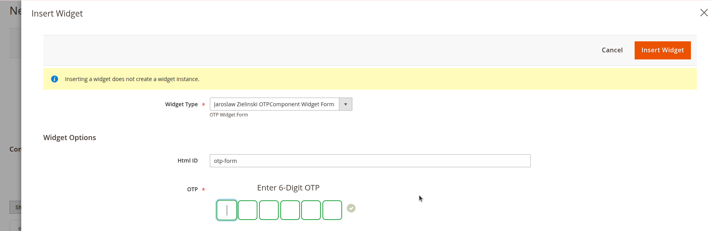

# OTP Component Magento2 Module
One Time Password Component Magento2 Module.

A comprehensive One-Time Password (OTP) component module that provides both frontend and backend implementations for secure email-based verification workflows.

If you're excited about this project and want to support its ongoing development, consider buying me a coffee! Your
support means a lot and helps keep this project alive.

[](https://www.buymeacoffee.com/jaroslawzielinski)

## Features

### Frontend Component
- **Multiple Integration Options**: Can be used in CMS pages, blocks, or widgets
- **Form Integration**: Seamlessly integrates with existing forms
- **Multiple Instances**: Support for multiple concurrent forms on the same page
- **reCAPTCHA Integration**: Built-in support for reCAPTCHA v2 (invisible mode)
- **Customizable Fields**: Hidden fields that can be overridden (e.g., Date of Birth)
- **Event-Driven Architecture**: Custom validation and action events

### Backend Component
- **UI Component**: Knockout.js-based backend interface
- **Admin Integration**: Native admin panel integration with menu links
- **Single Instance**: Optimized for single-instance backend usage
- **Test Interface**: Built-in test pages for both frontend and backend

### Core Functionality
- **6-Digit OTP**: Secure email-based verification codes
- **Two-Step Process**: Initial form submission followed by OTP verification
- **Custom Actions**: Configurable post-verification actions (database saves, API calls, etc.)
- **Validation Hooks**: Custom validation logic integration

## How It Works

1. **Initial Form Submission**: User fills out the basic form data and clicks Send button
2. **OTP Generation**: A 6-digit code is generated and sent to the provided email address
3. **Code Verification**: User enters the received code in the verification step
4. **Action Execution**: Upon successful verification, configured actions are executed

## Installation
You can find the module on [Packagist](https://packagist.org/packages/jaroslawzielinski/otpcomponent-m2). To install:
```bash
cd YourProject
composer require jaroslawzielinski/otpcomponent-m2
```

## Configuration

### Settings


### OTP Form Configuration


### reCaptcha

Configure reCAPTCHA v2 (invisible mode):


#### Widget Separation

Multiple frontend forms are supported through unique widget IDs (opt_widget_id)

### Sending Email


## Usage Examples

### Frontend Widget Implementation

Use this code to implement OTP Component in your form:

```xml
<block class="JaroslawZielinski\OTPComponent\Block\Container\Form\Otp" name="otp_widget" as="otp_widget">
    <arguments>
        <argument name="config" xsi:type="array">
            <item name="name" xsi:type="string">otp6_value</item>

            <item name="initialValue" xsi:type="string"/>
        </argument>

        <argument name="view_model" xsi:type="object">JaroslawZielinski\OTPComponent\ViewModel\Otp</argument>
    </arguments>
</block>
```


### CMS Page/Block/Widget Usages

#### Admin Panel -> CONTENT -> Elements -> Pages




#### Admin Panel -> CONTENT -> Elements -> Blocks


#### Admin Panel -> CONTENT -> Elements -> Widgets


**NOTE**: _Just remember to use different Html ID of forms in order to proper working._


### Backend UI Component

```xml
<field name="otp6_value" formElement="input">
    <argument name="data" xsi:type="array">
        <item name="config" xsi:type="array">
            <item name="component" xsi:type="string">JaroslawZielinski_OTPComponent/js/form/element/otp</item>

            <item name="template" xsi:type="string">JaroslawZielinski_OTPComponent/form/element/otp</item>

            <item name="digits" xsi:type="number">6</item>
        </item>
    </argument>

    <settings>
        <dataType>text</dataType>

        <label translate="true">OTP Code</label>

        <notice translate="true">Enter the 6-digit verification code</notice>

        <validation>
            <rule name="required-entry" xsi:type="boolean">true</rule>

            <rule name="validate-digits" xsi:type="boolean">true</rule>

            <rule name="min_text_length" xsi:type="number">6</rule>

            <rule name="max_text_length" xsi:type="number">6</rule>
        </validation>
    </settings>
</field>
```


## Events

### Frontend Events

#### Validation Event:

```xml
<event name="otpcomponent_controller_validation"...
```
implementation of a dispatcher:

```php
$this->eventManager->dispatch('otpcomponent_controller_validation', [
    'request' => $request
]);
```

**NOTE**: _Validation of all fields in the form. You may add your custom validation there._


#### Action Event:

```xml
<event name="otpcomponent_controller_authenticated"...
```

implementation of a dispatcher:

```php
$this->eventManager->dispatch('otpcomponent_controller_authenticated', [
    'tuple' => $tuple,
    'totals' => &$totals
]);
```

where `$tuple` is user form data,
and `$totals` are array return in json response.

**NOTE**: _Your custom action. In this example it is addition of new entry User in data base after success OTP authentication._

### Backend Events

Similar event structure available for backend implementations.

## Menu Integration

The module automatically adds menu items for testing:

- **Frontend Test**: `otpcomponent/form/test`
- **Backend Test**: `jaroslawzielinski_otpcomponent/form/test`

## Field Customization

### 1 Override extra hidden fields in the OTP Form by editing files:

#### 1.1 Hidden Extra Fields in `view/frontend/layout/jaroslawzielinski_otpcomponent_form_test.xml`

```xml
<block class="JaroslawZielinski\OTPComponent\Block\Container\Form\HiddenExtraFields" name="hidden_extra_fields"
    as="hidden_extra_fields">
    <arguments>
        <argument name="fields" xsi:type="array">
            <item name="dob" xsi:type="string">dob</item>
        </argument>
    </arguments>
</block>
```

**Note**: _Edit arguments. Change **fields** section only._

#### 1.2 Hidden Extra Fields in `etc/frontend/di.xml`

```xml
<virtualType name="JaroslawZielinski\OTPComponent\Block\Container\Form\HiddenExtraFields"
    type="JaroslawZielinski\OTPComponent\Block\Container\Form\Fields">
    <arguments>
        <argument name="template" xsi:type="string">JaroslawZielinski_OTPComponent::container/form/hiddenextrafields.phtml</argument>

        <argument name="data" xsi:type="array">
            <item name="fields" xsi:type="array">
                <item name="dob" xsi:type="string">dob</item>
            </item>
        </argument>
    </arguments>
</virtualType>
```

**Note**: _Edit arguments. Change **data** section only._

### 2 Override extra fields in the OTP Form by editing files:

#### 2.1 Extra Fields in `etc/frontend/di.xml`

```xml
<virtualType name="JaroslawZielinski\OTPComponent\Block\Container\Form\ExtraFields"
    type="JaroslawZielinski\OTPComponent\Block\Container\Form\Fields">
    <arguments>
        <argument name="template" xsi:type="string">Vendor_OTPComponent::container/form/extrafields.phtml</argument>
    </arguments>
</virtualType>
```

**Note**: _Edit arguments. Change **template** section only. Provide your .phtml template with your fields._

For example:

`view/frontend/templates/container/form/extrafields.phtml`

```php
<?php
    /** @var \Magento\Framework\View\Element\Template $block */
    /** @var \JaroslawZielinski\OTPComponent\Block\Container\Form $parentBlock */
    $parentBlock = $block->getParentBlock();
    $formId = $parentBlock->getFormId();
    $isDisabledFields = $parentBlock->getDisableFields();
    $format = \JaroslawZielinski\OTPComponent\Observer\Validation::JS_DATE_FORMAT;
?>
<div class="row">
    <div class="col-24 col-sm-24">
        <div class="subrow">
            <label for="dob-<?= $formId; ?>"><?= __('Date of Birth'); ?></label>
            <input type="text" class="dob-date" id="dob-<?= $formId; ?>" name="dob"
                placeholder="<?= __('Select your birth date'); ?>" readonly
                <?php if ($isDisabledFields):?>disabled<?php endif; ?> value="<?= $parentBlock->getDob(); ?>"
                <?= $parentBlock->getRequired(); ?>>
        </div>
    </div>
</div>
<script type="text/javascript">
    require([
        'jquery',
        'mage/translate',
        'jquery/ui'
    ], function ($, $t) {
        $(document).ready(function() {
            $('#dob-<?= $formId; ?>').datepicker({
                dateFormat: '<?= $format; ?>',
                maxDate: 0, // Prevent future dates
                yearRange: '1900:c+0', // Years from 1900 to current year
                changeMonth: true,
                changeYear: true,
                showButtonPanel: false
            });
        });
    });
</script>
```

### 3 Override Submit Script:

#### 3.1 Submit Script in `view/frontend/layout/jaroslawzielinski_otpcomponent_form_test.xml`

```xml
<block class="JaroslawZielinski\OTPComponent\Block\Container\Form\SubmitScript" name="submit-script"
    as="submit-script">
    <arguments>
        <argument name="form_id" xsi:type="string">otp-form</argument>

        <argument name="recaptcha_block" xsi:type="string">recaptcha.v2.invisible</argument>
    </arguments>
</block>
```

## Browser Support

- Modern browsers with JavaScript enabled
- jQuery 1.9+
- Knockout.js 3.0+ (for backend components)

## Contributing

1. Fork the repository
2. Create your feature branch (`git checkout -b feature/amazing-feature`)
3. Commit your changes (`git commit -m 'Add some amazing feature'`)
4. Push to the branch (`git push origin feature/amazing-feature`)
5. Open a Pull Request

## License

This project is licensed under the MIT License - see the [LICENSE](LICENSE) file for details.

## Support

For support and questions, please open an issue in the GitHub repository.

---

Explore these features, play with the settings, and see how this module can elevate your **Magento2** site! And if you find
value in this, I'd greatly appreciate your support on [**Buy Me a Coffee**](https://www.buymeacoffee.com/jaroslawzielinski) — it helps keep projects like this alive.


[](https://www.buymeacoffee.com/jaroslawzielinski)

**Happy Coding!** 🚀
